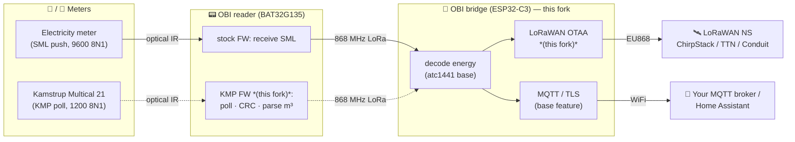

# 🐄🥚 The Eierlegende Wollmilchsau

### One €-few OBI/heyOBI plug → **any meter, over LoRaWAN _and_ MQTT**

*A firmware fork that turns a cheap smart-plug energy reader into a universal, self-hosted metering node — electricity today, water next.*

---

> ### 🙏 Credit where it's due
> This is a **fork** of **[Aaron Christophel (atc1441)](https://github.com/atc1441/OBI_Energy_Tracker_Local_Cloud)**'s
> open OBI/heyOBI firmware. **Every bit of the hard reverse-engineering** — the proprietary 868 MHz LoRa
> protocol, the ECDH key exchange, the TEA-ECB energy decryption, the beacon timing, and the entire base
> gateway firmware (reader pairing, on-device decode, web dashboard, MQTT/Home-Assistant, reader-OTA,
> self-update) — **is his.** Without it, none of this exists. Watch his [YouTube series](https://www.youtube.com/watch?v=2jMEaRuSJ18)
> and read the [Hackaday writeup](https://hackaday.com/2026/07/07/reverse-engineering-and-self-hosting-the-obi-smart-energy-tracker/).
> The LoRaWAN layer stands on **[RadioLib](https://github.com/jgromes/RadioLib)** by Jan Gromeš.
> Upstream `LICENSE`/`DISCLAIMER.md` are preserved unchanged; this fork **adds** code and ships **no** vendor binaries.

## Why?

The OBI/heyOBI reader is a battery gadget that clamps onto a meter's optical eye and relays readings to a
plug-in bridge over 868 MHz. atc1441 freed it from the vendor cloud. **This fork frees the *data* onto open
infrastructure** — and asks: if the reader can read one optical meter, why not *any* of them?

- **Electricity today** — decoded energy uplinked over **standard LoRaWAN OTAA (EU868)** to any network
  server (ChirpStack, TTN, a Multitech Conduit…), *and/or* pushed straight to your **TLS MQTT broker**.
- **Water next** — a firmware mod that makes the very same reader actively poll a **Kamstrup Multical 21**
  water meter (KMP protocol) and report m³ over the exact same backhaul.

One cheap plug. Any meter. Your infrastructure. *The egg-laying wool-milk-sow.* 🐄

## Architecture

*(Solid = shipping & verified; dashed = the water path — code complete, hardware validation in progress.)*

## Feature status

| Feature | What it does | Status |
|---|---|---|
| **LoRaWAN OTAA uplink** | electricity reader → any LoRaWAN network server (EU868) | ✅ **Verified on hardware** — live end-to-end, joined + uplinking |
| **MQTT / TLS push** | reader data → your own broker over WiFi | ✅ Upstream feature (atc1441) |
| **On-device decode, dashboard, reader-OTA** | the whole base gateway | ✅ Upstream feature (atc1441) |
| **Water KMP reader firmware** | reader actively polls a Kamstrup Multical 21 → m³ | 🧪 **Code complete & compiles; on-meter validation in progress** |

> 📌 **Maintainers:** flip the water row to `✅ Verified on hardware` once the first real m³ reading lands on
> the network server — everything else in this doc is already written for that moment.

## ⚡ Feature 1 — LoRaWAN OTAA bridge *(verified)*

The base firmware already decodes each reader's plaintext energy struct on-device. This fork adds a
**self-contained LoRaWAN subsystem** that forwards it over EU868 OTAA — so an OBI electricity reader becomes
a first-class node of an existing LoRaWAN metering fleet, alongside the base firmware's MQTT path.

- **SHARED single-radio design** — time-shares the one SX1262 between the OBI master role and periodic
  LoRaWAN transactions; **no second radio.**
- **Runtime-gated, default-OFF** — flashing the fork boots *exactly* like the base firmware until you opt in
  with `POST /api/lw en=1`. Existing users are unaffected.
- **Session persistence** — join nonces + session survive reboots (resumes, no needless re-join).
- **Fleet DevEUI convention** — derived on-chip (`FE | utility | hardware | chip-MAC`); no manual serials.
- **Compact codec** — schema-versioned frame, up to 3 readers/uplink, mirrored ChirpStack JS decoder.

**Try it:** enable via the dashboard (`POST /api/lw?en=1`), register the DevEUI it reports at `GET /api/lw`
on your network server (AppEUI `0`, your AppKey), and watch the join. Full detail, wiring, and the toolchain
story: **[`LORAWAN.md`](LORAWAN.md)**.

<b>🔧 The bug that made it work (RF-switch during LoRaWAN TX)</b>

The single SX1262 is shared, and the LoRaWAN transaction left the **DIO2 RF switch** in the wrong state —
so every join transmitted into a disconnected antenna: `radio.begin` fine, `NO_JOIN_ACCEPT`, and the gateway
heard *nothing* even at 1 m. The fix re-asserts `setDio2AsRfSwitch(true)` immediately before every LoRaWAN
TX (`obiLwAssertRfSwitch()`). Neither range nor keys — just the antenna path. Also resolved: a framework /
RadioLib version match (arduino-esp32 3.1.3 · IDF 5.3.2 · RadioLib 7.7.1) that fixes SX126x SPI init.

## 🚰 Feature 2 — Water: the Kamstrup KMP reader firmware *(validating)*

The reader's optical UART is **full-duplex** and the stock firmware already does *active* optical polling
(it carries an IEC 62056-21 `/?!` request). That means the reader can **transmit** a query — so it can speak
**KMP** to a Kamstrup Multical 21, not just passively receive SML. The mod is small and stays inside the
firmware's normal envelope:

1. **Retune** the optical UART 9600 → **1200 baud** (framing stays 8N1 — identical to SML). The reader already
   ships multiple baud profiles, so this uses the vendor's own tested baud path.
2. **Poll** — transmit the field-validated volume query `80 3F 10 01 00 44 4D C0 0D` (register `0x0044`).
3. **Decode** — a bounded, non-blocking RX collector destuffs, checks the CRC (CCITT `0x1021`, bitwise), and
   parses unit / exponent / mantissa → **litres**.
4. **Report** — drops the volume into the reader's energy field so it rides the *existing* LoRaWAN/MQTT uplink
   untouched; the backhaul just branches on FPort/unit for m³.

**Bonus:** the OBI reader has an **integrated magnet**, which wakes the Multical 21's Hall-sensor optical eye —
no glued-on magnets like a DIY head needs.

Hook source: [`reader_firmware_mod/kmp_hook.c`](reader_firmware_mod/kmp_hook.c) *(compiles clean, 393 B, fits
the reader's free flash).* Safety by design: the RX wait is **timeout-bounded**, so a non-responding meter can
never wedge the reader's radio/OTA phase — it stays recoverable (bootloader validates OTA; gateway re-serves
stock; BAT32 SWD unfused).

## Roadmap

- [x] LoRaWAN OTAA uplink — **live on hardware**
- [x] Rebase onto upstream `v1.2.47` (SF7/SF9 reconciled) — *branch `rebase/upstream-1.2.47`, compiles*
- [x] Water KMP hook — **written & compiles**
- [ ] Water: on-meter validation → first m³ on the network server
- [ ] External u.FL antenna characterization for field range
- [ ] Publish signed release `.bin`s for the fork's own self-updater

## License & attribution

This fork preserves the upstream `LICENSE` and `DISCLAIMER.md` unchanged, adds only new source, and ships no
vendor firmware binaries. All reverse-engineering and base firmware © **Aaron Christophel (atc1441)**; LoRaWAN
layer built on **RadioLib** © Jan Gromeš. Fork additions (LoRaWAN bridge, water KMP hook) contributed back for
anyone who wants a cheap, open, universal optical-meter node.
